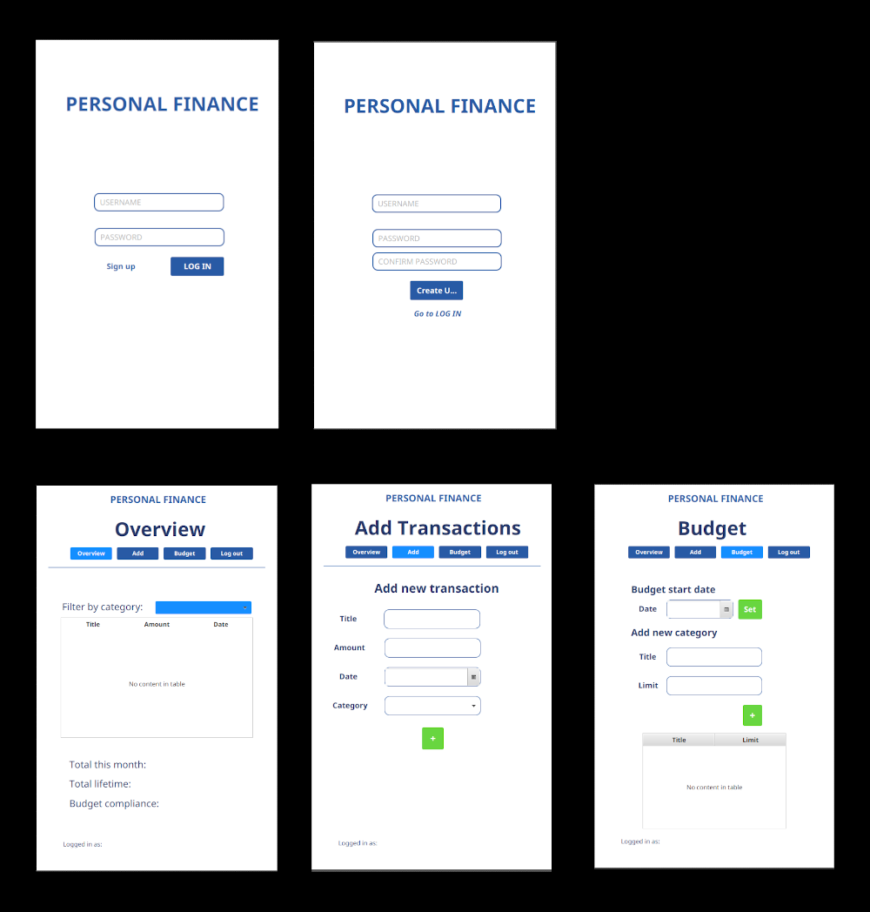

# Personal Finance - The application

Open the project in GitPod: []

***Personal Finance Application***

**Description** -
A personal accounting application with the main functionality to be able to add a user and add your income and expense posts and get a total sum of your economic status.
The application will have a GUI for the users profile, transactions (money flowing in and out of ones account(s)), different accounts, loans and debt.

**Visuals** -

**Installation** -
The application is able to run through GitPod in an IDE or through a web browser without further installations.

**Usage** -
The goal for the usage of this application is that the user will have a more collected view of it's finances, by more clearly seeing how it's total fortune changes over time.

**Support** -
For questions or issues regarding the project, contact the authors by mail.

**Authors** -
Eduard Prokhorikhin - eduardpr@stud.ntnu.no
Maria Hurtado Beisvåg - marihbei@stud.ntnu.no
Olav Selnes Lorentzen - olavslo@stud.ntnu.no
Trygve Nummedal Os - trygno@stud.ntnu.no

**Roadmap**

**Project status** -
The project will be further developed throughout the fall semester of 2022.